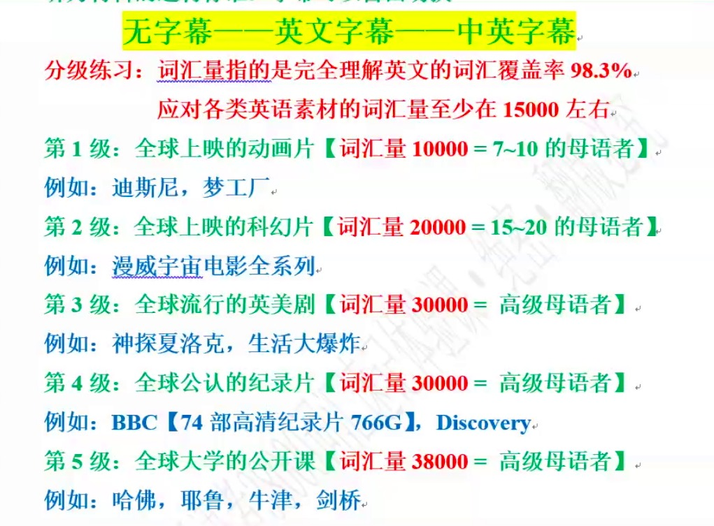

# 第二堂课笔记

>【金字塔排序的意义】：以战养战

## 【词根】： -nat-(生)  -form-(形成)

## 【前缀】：（常见30个）

```js
de- 向下，分
inter- 在...之间，互相
trans- 通过，改变
un- 否定

in- 否定，内向，强调，使动
non- 否定
semi- 半
per- 完全
trans- 通过，改变
de- 分，向下
```

## 【后缀】：（常见40个）

```js
-er === or 形容词或名词后缀
-ed 形容词、过去式、过去分词
-less 形容词后缀，表否定
-ness 名词后缀
-al 形容词或名词后缀
-ly 副词后缀
-ity 名词后缀，表抽象含义

-ics 学术名词后缀
-ate 动词或形容词后缀
-ion 名词后缀
-ist 形容词或名词后缀
-ic 形容词或名词后缀
-s 名词后缀，复数名词后缀
-ize 动词后缀，表使动
-ism 名词后缀，表...主义
-ist 名词后缀，表...主义者
-ant 名词或形容词后缀
-ive 名词或形容词后缀
-ance 名词后缀
-ing 形容词、动名词、现在分词
-able 形容词后缀，表能...的
-ation 复合名词后缀
-ure 名词或动词后缀
```

## 【课后练习】：

|         单词         | 前缀1 | 词根1 | 后缀1 | 后缀2 | 后缀3 | 后缀4 | 后缀5 | 含义 | 含义备选项（数字填写到'含义栏'） |
| :------------------: | :---: | :---: | :---: | :---: | :---: | :---: | :---: | :--: | -------------------------------- |
|      formality       |       |       |       |       |       |       |       |      | 1、adj.自然主义的                |
|  denationalization   |       |       |       |       |       |       |       |      | 2、n.表演性                      |
|      naturally       |       |       |       |       |       |       |       |      | 3、n.国有化                      |
|      formation       |       |       |       |       |       |       |       |      | 4、n.变形金刚                    |
|     naturalistic     |       |       |       |       |       |       |       |      | 5、n.跨国化                      |
|   transfromational   |       |       |       |       |       |       |       |      | 6、n.编队                        |
|   nationalization    |       |       |       |       |       |       |       |      | 7、adj.转换的                    |
| transnationalization |       |       |       |       |       |       |       |      | 8、n.礼节                        |
|     transformer      |       |       |       |       |       |       |       |      | 9、n.非国有化                    |
|    performativity    |       |       |       |       |       |       |       |      | 10、adv.自然地                   |

___

## 【听力练习推荐看片】：

