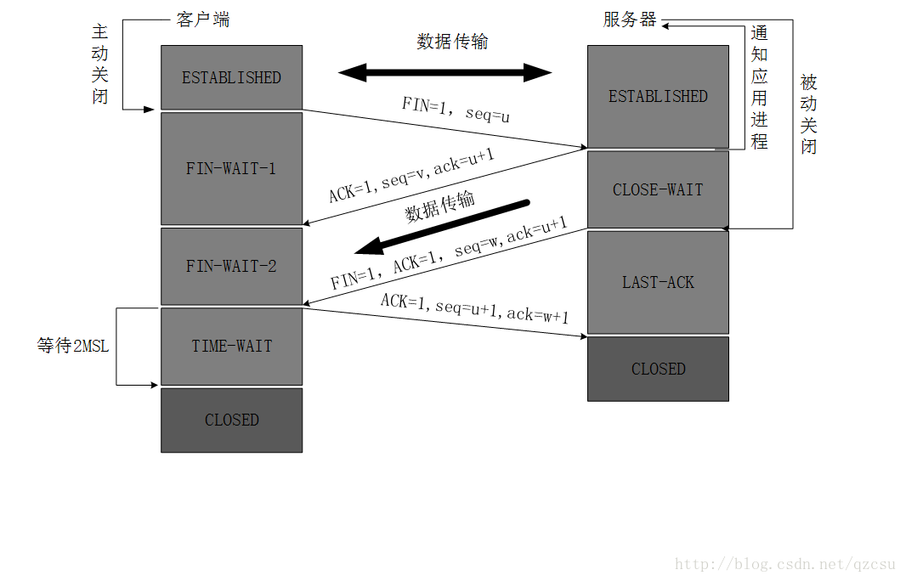

## TCP三次握手四次挥手

### TCP的状态 (SYN, FIN, ACK, PSH, RST, URG)

> 在TCP层，有个FLAGS字段，这个字段有以下几个标识：SYN, FIN, ACK, PSH, RST, URG.
>
> 其中，对于我们日常的分析有用的就是前面的五个字段。

```js
SYN表示建立连接，

FIN表示关闭连接，

ACK表示响应，

PSH表示有 DATA数据传输，

RST表示连接重置。
```

其中，ACK是可能与SYN，FIN等同时使用的，比如SYN和ACK可能同时为1，它表示的就是建立连接之后的响应，

如果只是单个的一个SYN，它表示的只是建立连接。

TCP的几次握手就是通过这样的ACK表现出来的。

但`SYN`与`FIN`是不会同时为1的，因为前者表示的是`建立连接`，而后者表示的是`断开连接`。


RST一般是在FIN之后才会出现为1的情况，表示的是连接重置。

 一般地，当出现FIN包或RST包时，我们便认为客户端与服务器端断开了连接；而当出现SYN和SYN＋ACK包时，我们认为客户端与服务器建立了一个连接。


PSH为1的情况，一般只出现在 DATA内容不为0的包中，也就是说PSH为1表示的是有真正的TCP数据包内容被传递。


TCP的连接建立和连接关闭，都是通过请求－响应的模式完成的。

概念补充-TCP三次握手：

TCP(Transmission Control Protocol)传输控制协议

TCP是主机对主机层的传输控制协议，提供可靠的连接服务，采用三次握手确认建立一个连接：

位码即tcp标志位，有6种标示：

`SYN`(synchronous建立联机) 

`ACK`(acknowledgement 确认) 

`PSH`(push传送) 

`FIN`(finish结束) 

`RST`(reset重置) 

`URG`(urgent紧急)

`Sequence number`(顺序号码，用小写`seq`代替) 

`Acknowledge number`(确认号码，用小写`ack`代替)

### TCP连接的建立（三次握手）

> TCP三次握手如图：


1. TCP服务器进程先创建传输控制块TCB，时刻准备接受客户进程的连接请求，此时服务器就进入了LISTEN（监听）状态；
2. TCP客户进程也是先创建传输控制块TCB，然后向服务器发出连接请求报文，这是报文首部中的同部位`SYN=1`，同时选择一个初始序列号 seq=x ，此时，TCP客户端进程进入了 SYN-SENT（同步已发送状态）状态。<font color=red>TCP规定，SYN报文段（`SYN=1`的报文段）不能携带数据，但需要消耗掉一个序号。</font>
3. TCP服务器收到请求报文后，如果同意连接，则发出确认报文。确认报文中应该 `ACK=1`，`SYN=1`，确认号是ack=x+1，同时也要为自己初始化一个序列号 seq=y，此时，TCP服务器进程进入了SYN-RCVD（同步收到）状态。<font color=red>这个报文也不能携带数据，但是同样要消耗一个序号。</font>
4. TCP客户进程收到确认后，还要向服务器给出确认。确认报文的`ACK=1`，ack=y+1，自己的序列号seq=x+1，此时，TCP连接建立，客户端进入ESTABLISHED（已建立连接）状态。<font color=red>TCP规定，ACK报文段可以携带数据，但是如果不携带数据则不消耗序号。</font>
5. 当服务器收到客户端的确认后也进入ESTABLISHED状态，此后双方就可以开始通信了。

### 为什么TCP客户端最后还要发送一次确认呢？

一句话，主要防止已经失效的连接请求报文突然又传送到了服务器，从而产生错误。

如果使用的是两次握手建立连接，假设有这样一种场景，<font color=blue>客户端发送了第一个请求连接并且没有丢失，只是因为在网络结点中滞留的时间太长了，</font>由于TCP的客户端迟迟没有收到确认报文，以为服务器没有收到，此时重新向服务器发送这条报文，此后客户端和服务器经过两次握手完成连接，传输数据，然后关闭连接。<font color=blue>此时此前滞留的那一次请求连接，网络通畅了到达了服务器，这个报文本该是失效的，但是，两次握手的机制将会让客户端和服务器再次建立连接，这将导致不必要的错误和资源的浪费。</font>

如果采用的是三次握手，就算是<font color=green>那一次失效的报文传送过来了，服务端接受到了那条失效报文并且回复了确认报文，但是客户端不会再次发出确认。</font>由于服务器收不到确认，就知道客户端并没有请求连接。


> 数据传输完毕后，双方都可释放连接。最开始的时候，客户端和服务器都是处于ESTABLISHED状态，然后客户端主动关闭，服务器被动关闭。tcp四次挥手如图：



1. 客户端进程发出连接释放报文，并且停止发送数据。释放数据报文首部，FIN=1，其序列号为seq=u（等于前面已经传送过来的数据的最后一个字节的序号加1），此时，客户端进入FIN-WAIT-1（终止等待1）状态。 <font color=red face="黑体">TCP规定，FIN报文段即使不携带数据，也要消耗一个序号。</font>
2. 服务器收到连接释放报文，发出确认报文，ACK=1，ack=u+1，并且带上自己的序列号seq=v，此时，服务端就进入了CLOSE-WAIT（关闭等待）状态。<font color=red face="黑体">TCP服务器通知高层的应用进程，客户端向服务器的方向就释放了，这时候处于半关闭状态，即客户端已经没有数据要发送了，但是服务器若发送数据，客户端依然要接受。</font><font color=blue>这个状态还要持续一段时间，也就是整个CLOSE-WAIT状态持续的时间。</font>
3. 客户端收到服务器的确认请求后，此时，客户端就进入FIN-WAIT-2（终止等待2）状态，等待服务器发送连接释放报文<font color=red>（在这之前还需要接受服务器发送的最后的数据）。</font>
4. 01服务器将最后的数据发送完毕后，就向客户端发送连接释放报文，FIN=1，ack=u+1，由于在半关闭状态，服务器很可能又发送了一些数据，假定此时的序列号为seq=w，此时，服务器就进入了LAST-ACK（最后确认）状态，等待客户端的确认。
5. 客户端收到服务器的连接释放报文后，必须发出确认，ACK=1，ack=w+1，而自己的序列号是seq=u+1，此时，客户端就进入了TIME-WAIT（时间等待）状态。<font color=red>注意此时TCP连接还没有释放，必须经过2∗∗MSL（最长报文段寿命）的时间后，当客户端撤销相应的TCB后，才进入CLOSED状态。</font>
6. 服务器只要收到了客户端发出的确认，立即进入CLOSED状态。同样，撤销TCB后，就结束了这次的TCP连接。<font color=red>可以看到，服务器结束TCP连接的时间要比客户端早一些。</font>

### 为什么客户端最后还要等待2MSL？

MSL（Maximum Segment Lifetime），TCP允许不同的实现可以设置不同的MSL值。

第一，保证客户端发送的最后一个ACK报文能够到达服务器，因为这个ACK报文可能丢失，<font color=blue>站在服务器的角度看来，我已经发送了FIN+ACK报文请求断开了，客户端还没有给我回应，应该是我发送的请求断开报文它没有收到，于是服务器又会重新发送一次，</font>而客户端就能在这个2MSL时间段内收到这个重传的报文，接着给出回应报文，并且会重启2MSL计时器。

第二，防止类似与“三次握手”中提到了的“已经失效的连接请求报文段”出现在本连接中。客户端发送完最后一个确认报文后，在这个2MSL时间中，就可以使本连接持续的时间内所产生的所有报文段都从网络中消失。这样新的连接中不会出现旧连接的请求报文。

为什么建立连接是三次握手，关闭连接确是四次挥手呢？

建立连接的时候， 服务器在LISTEN状态下，收到建立连接请求的SYN报文后，把ACK和SYN放在一个报文里发送给客户端。 

而关闭连接时，服务器收到对方的FIN报文时，仅仅表示对方不再发送数据了但是还能接收数据，而自己也未必全部数据都发送给对方了，所以己方可以立即关闭，也可以发送一些数据给对方后，再发送FIN报文给对方来表示同意现在关闭连接，因此，己方ACK和FIN一般都会分开发送，从而导致多了一次。

### 如果已经建立了连接，但是客户端突然出现故障了怎么办？

TCP还设有一个`保活计时器`，显然，客户端如果出现故障，服务器不能一直等下去，白白浪费资源。服务器每收到一次客户端的请求后都会重新复位这个计时器，<font color=blue>时间通常是设置为2小时</font>，若两小时还没有收到客户端的任何数据，服务器就会发送一个<font color=blue>探测报文段，以后每隔75秒发送一次</font>。若一连发送10个探测报文仍然没反应，服务器就认为客户端出了故障，接着就关闭连接。