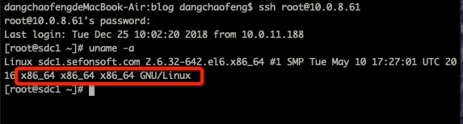
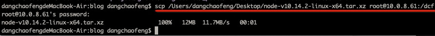

1. 首先我们本地需要有一个已经下载好的node文件

   * [下载地址1（英文）]: (https://nodejs.org/en/download/)

   * [下载地址2（中文）]: (http://nodejs.cn/download/)

     >  备注： 首先通过ssh连接我们要进入的linux系统中，输入密码连接成功后，通过  uname -a  命令查看到Linux系统位数是64位（备注：x86_64表示64位系统， i686 i386表示32位系统），如图：

   	

   > 所以我们需要下载一个64位linux二进制包。

   

2. 将下载下来的文件上传服务器并解压，查看版本正常后，进行创建全局软连接

   * 将文件上传服务器，通过scp命令，如图：

     

   * 然后再次通过ssh连接服务器后，在上面找到文件进行解压，正常流程如图：

     > 备注：正常流程，linux支持xz解压，将文件解压为tar类型，再通过tar -xvf 解决即可。
     >
     > 如果你的linux不支持xz解压，请[下载配置xz](https://www.jianshu.com/p/6efadc7f86cf)

     

   * 最后一步，我们需要进入我所在tar解压后的文件夹下/bin

     > 备注：进入到文件夹/bin下后，ls一下，会发现有node 和npm的存在，我们执行了node -v, npm -v；发现提示command not fount 命令不存在，因为我们没有创建全局软连接。
     >
     > * ln -s /dcf/node-v10.14.2-linux-x64/bin/node /usr/local/bin/
     > * ln -s /dcf/node-v10.14.2-linux-x64/bin/npm /usr/local/bin/
     >
     > 通过ln -s 创建全局软连接之后，就可以正常使用。
     >
     > 注意：一定要用绝对路径，不要用相对路径去配置软连接，那样会无效！

     

3. 全局软连接建立完成后，执行node -v； npm -v；发现有版本后，就说明安装成了。